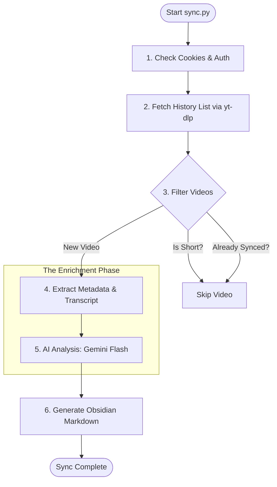

## Logic Breakdown: `sync.py`

The `sync.py` script is a sophisticated data pipeline that transforms your "passive" YouTube watch history into an "active" knowledge base. It uses a **Fetch → Extract → Analyze → Store** pattern.

### 1. High-Level Workflow Diagram

To start, let’s look at the "big picture" of how data flows through the script:

### 2. The Functional Logic Layers

I’ve broken the script's logic into four key phases to make it easier to digest:

#### Phase A: Authentication & Discovery (`get_recent_history`)
The script doesn't log into Google directly (which is hard and risky!). Instead, it "borrows" the session from your browser.
*   **Cookie Extraction:** It uses `yt-dlp` with the `--cookies-from-browser` flag to access your authenticated YouTube session.
*   **The History Feed:** It targets `https://www.youtube.com/feed/history`.
*   **Result:** It returns a list of `VideoMeta` objects (ID, Title, Uploader).

#### Phase B: Smart Filtering
Before doing any heavy lifting, the script applies two "high-signal" filters:
1.  **Incremental Check:** It checks if a `.md` file with that title already exists in your `YouTube/` folder. If it does, it skips it!
2.  **Shorts Detection (`is_youtube_short`):** It sends a lightweight `HEAD` request to the video URL. If it's a "Short," it's usually low-signal for a knowledge base, so it gets skipped to keep your vault clean.

#### Phase C: Data Enrichment
This is where the script gathers the "meat" of the content:
*   **Metadata Extraction:** `get_video_details` uses `yt-dlp` to pull the full description and channel info.
*   **Transcript Extraction (`get_transcript`):** It uses the `youtube_transcript_api`. It intelligently tries to find English or Chinese transcripts first, falling back to auto-generated ones if necessary.

#### Phase D: AI Orchestration (`summarize_and_tag`)
This is the "brain" of the operation. It sends the Title, Description, and Transcript to **Gemini 2.5 Flash**:
*   **Schema-Driven:** It uses a `Pydantic` model (`ProcessedTranscript`) to force Gemini to return structured JSON.
*   **Taxonomy Alignment:** It provides the `TAXONOMY_HINT` so Gemini picks tags from your official categories (like `Technology/AI`).
*   **Keyword Extraction:** It grabs specific entities like `Person/ElonMusk` or `Company/NVIDIA`.

### 3. Resilience & Performance Features

To make sure a single error doesn't crash the whole sync, the script uses several "Pro" patterns:

| Feature | Logic | Why it matters |
| :--- | :--- | :--- |
| **Concurrency** | `ThreadPoolExecutor` (Size: 2) | Processes multiple videos at once without waiting for Gemini's API latency. |
| **Retries** | `@retry` (Tenacity library) | If a network request fails, it tries again with "exponential backoff" to avoid being blocked. |
| **Rate Limiting** | `time.sleep` delays | Keeps the script under the Gemini RPM limits and avoids triggering YouTube's IP blocks. |
| **Failure Cache** | `.failed_videos.txt` | If a video *consistently* fails (e.g., it's private or deleted), it's recorded here so we don't keep wasting API calls on it. |

### 4. The Final Output (`save_to_obsidian`)
The last step is purely structural. It takes all that enriched data and writes a **Markdown file** with a YAML frontmatter. This turns your video into a searchable "Node" that Obsidian's Graph View and Dataview can understand.
