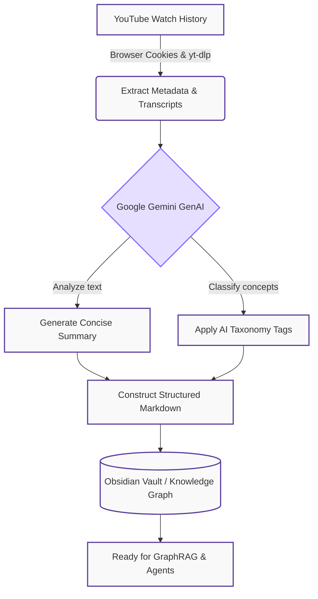

# 📺 ObsidianYouTubeSync

**Download, sync, and organize your entire YouTube watch history into a structured, AI-tagged knowledge graph — ready for Obsidian, OpenClaw, and GraphRAG pipelines.**

---

## What is ObsidianYouTubeSync?

This tool automates the full pipeline of extracting intelligence from your passive YouTube viewing history. It:

1. **Downloads** your full YouTube watch history (incremental or bulk) using `yt-dlp`.
2. **Extracts** full captions and transcripts for every video (with fallback to auto-generated captions).
3. **Summarizes** each video using Google Gemini LLM (GenAI) into concise, searchable text.
4. **Categorizes** content with a shared hierarchical taxonomy (e.g., `Technology/ArtificialIntelligence`, `Science/Neuroscience`) using AI classification.
5. **Organizes** notes into Obsidian with clean YAML frontmatter (tags, url, channel, date, summary) — queryable via Dataview.

### 🗺️ Pipeline Architecture

## Why build this?

If you have hundreds or thousands of videos in your YouTube history, finding insights buried in that content is nearly impossible without structure. 

**Use cases include:** 
- Personal knowledge management (PKM)
- YouTube history cataloging
- Knowledge graph construction
- Transcript dataset preparation
- GraphRAG ingestion
- OpenClaw/LLM agent tooling
- Personal AI training data
- Second brain building

## 🧠 Key Features

| Feature | Details |
|---|---|
| **LLM Summarization** | Google Gemini (GenAI) generates concise, high-quality summaries for every video. |
| **Full Transcript Download** | Pulls manual and auto-generated captions from YouTube. |
| **Hierarchical AI Tagging** | Applies CamelCase taxonomy tags like `Technology/AI/LLM`. |
| **History Sync** | Incremental detection to download & sync watch history via browser cookies. |
| **YouTube Shorts Skip** | Automatically detects and skips Shorts to keep your knowledge base high-signal. |
| **Vault-wide Retagging** | Retag any folder (Apple Notes, Books, etc.) using the same global AI taxonomy. |
| **Parallel Processing** | Syncs 100s of videos in minutes using `ThreadPoolExecutor`. |
| **MCP Server** | Native Model Context Protocol server for AI agent integration. |
| **GraphRAG-Ready Output** | Structured Markdown with rich metadata nodes. |

---

[Ready to get started? Check out the Setup Guide](setup.md){ .md-button .md-button--primary }
